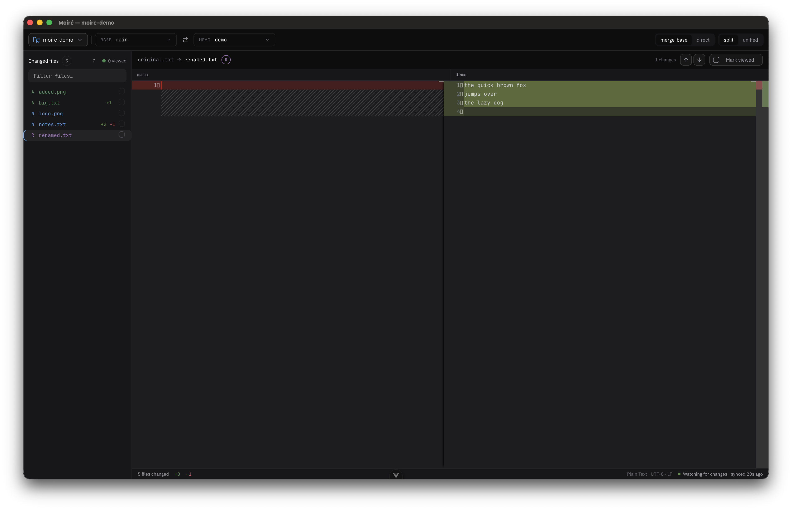
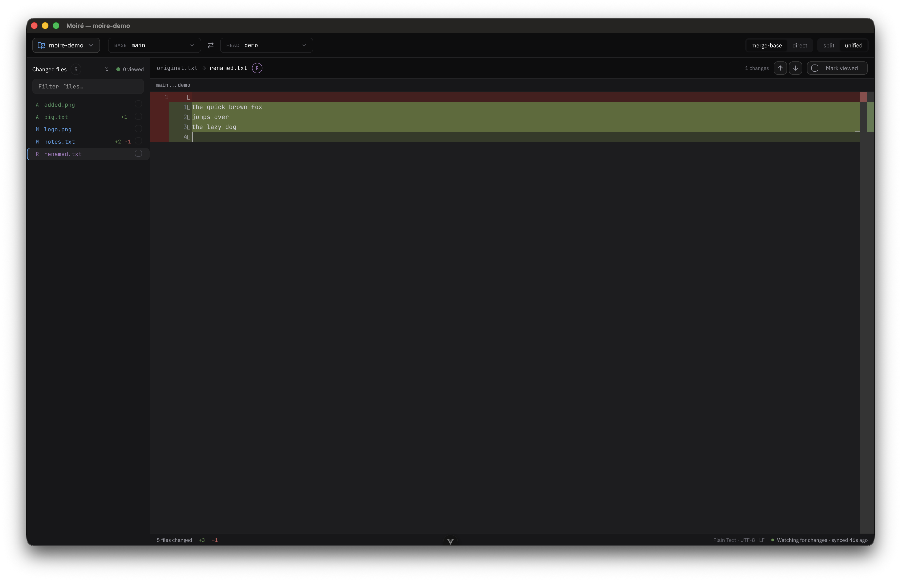
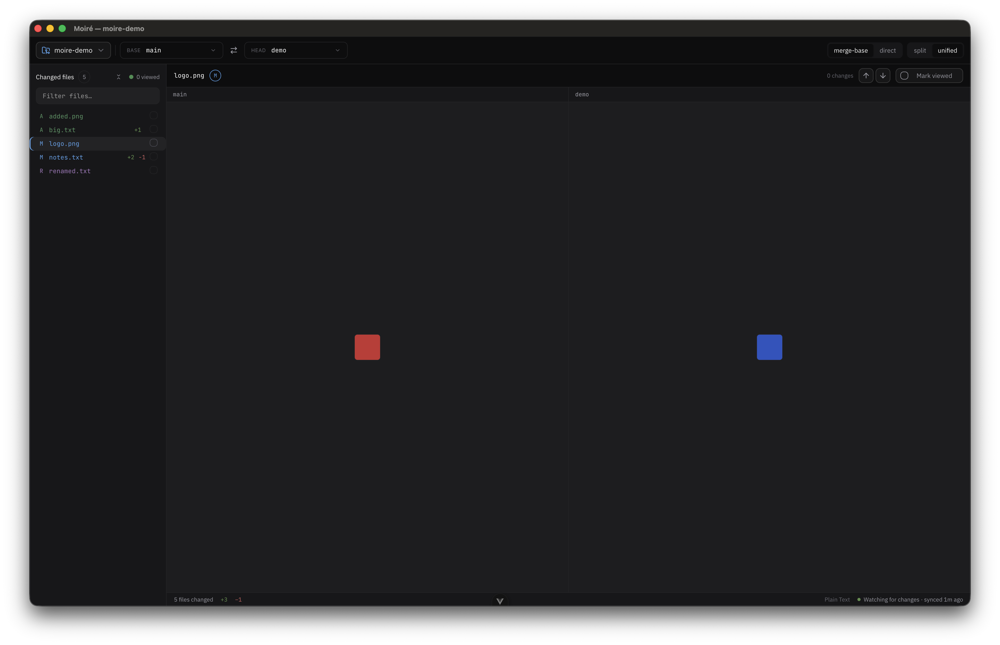

# Moiré

A desktop app for viewing the diff between two branches of a local Git repository, with a look
and feel modeled on GitHub's pull request diff view and PhpStorm's diff tool.

The name comes from the moiré pattern: overlay two nearly identical grids and the mismatches
surface as a shimmer you cannot miss. That is what a diff does, difference made visible by
superimposition.

## Screenshots



| Unified view                                                                       | Image preview                                                                             |
| ---------------------------------------------------------------------------------- | ----------------------------------------------------------------------------------------- |
|  |  |

## Requirements

- macOS, Windows, or Linux (only macOS has been verified so far, see [Known issues](#known-issues)).
- To run from source or build the app: Node `^22.18.0 || >=24.12.0`.
- A local Git repository with at least two branches to compare.

## Running the app

There are two ways to get the app on screen. Running from source is the quickest. Building a
packaged app gives you a standalone `.app` you can keep in your Applications folder.

### Option 1: run from source

```bash
npm install     # install dependencies (first time only)
npm run dev     # start Vite and the Electron window with hot reload
```

The window opens automatically. Code changes reload live.

### Option 2: build and install a standalone app

```bash
npm run pack    # build the renderer and package the app into release/
```

On macOS this writes a `.dmg` and a `.zip` for both Apple Silicon (`arm64`) and Intel (`x64`) into
`release/`. Open the `.dmg` and drag Moiré into Applications.

Because the app is not code-signed, macOS Gatekeeper blocks it on first launch. To open it the
first time, right-click (or Control-click) the app in Applications and choose **Open**, then
confirm. After that it opens normally. (Windows and Linux targets are configured but unverified.)

## Using the app

1. **Pick a repository.** Click the repository button in the top-left and choose **Open folder…**,
   or select one you opened before from **Recent**. You can also use **File > Open Repository…**
   (`Cmd/Ctrl+O`).
2. **Choose the two branches.** Set the **base** on the left and the **head** on the right. Base is
   the branch you compare against (often `main`); head is the branch whose changes you want to see.
   The swap button between them flips the two.
3. **Choose how to compare.** Toggle between:
    - **merge-base**: compares head to the point where it branched off base, showing only the changes
      head introduces. This matches what a GitHub pull request shows.
    - **direct**: compares the base and head tips directly, so commits added to base after head
      branched off also show up.
4. **Choose the layout.** Toggle between **split** (side by side) and **unified** (single column).
5. **Browse the changes.** The sidebar lists every changed file as a tree. Click a file to open its
   diff. Mark a file or a whole folder as viewed to keep track of what you have already read.
   Renames, binary files, and images are handled with their own previews, and very large files sit
   behind a click so they never lock up the window.

The diff refreshes on its own when the repository changes on disk. Use **View > Refresh**
(`Cmd/Ctrl+R`) to re-scan manually. Set the appearance under **View > Theme** (System, Light, or
Dark) and the diff coloring under **View > Code Style** (GitHub or VS Code); your choices and the
last branch range are remembered per repository.

## Features

- Two-branch diff for any local Git repository, with `merge-base` (pull-request style) and `direct`
  comparison modes.
- Split and unified layouts, powered by the Monaco editor.
- A virtualized file tree that stays smooth on large change sets, with per-file and per-folder
  "mark viewed" progress.
- Rename detection, binary-file notices, and inline image previews.
- A large-file gate so oversized files never freeze the UI.
- Recent-repository list and a native folder picker.
- Auto-refresh when the working tree changes, plus a manual refresh.
- System, light, and dark themes, with theme and branch selections persisted per repository.
- A selectable diff color style (GitHub or VS Code) under **View > Code Style**, persisted across launches.
- A status bar reporting line-ending style and how long ago the diff was synced.

## Development

```bash
npm run test:unit     # run the Vitest suite
npm run type-check    # vue-tsc project type check
npm run lint          # oxlint with autofix
npm run format        # oxfmt
```

### Stack

Vue 3, Vite 8, Electron 44, TypeScript, Tailwind CSS v4, shadcn-vue (Reka UI), Pinia, and Monaco
for the diff view.

### UI components

All interactive UI is built on shadcn-vue primitives (Reka UI under the hood), which live in
`src/components/ui/`. Add new primitives with `npx shadcn-vue@latest add <name>`. Do not
hand-write bespoke replacements for something shadcn-vue provides. The primitives are styled with
the project's `--moire-*` design tokens so they match the custom look. See
`documentation/code-conventions.md` for the full rules.

## Known issues

Track bugs and limitations here.

- **The macOS app name shows `Moire` (no accent) in the menu bar, dock, and About panel.** Those
  come from `CFBundleName`, which has to be ASCII because a non-ASCII value crashes the unsigned
  app on Apple Silicon. The accent is used everywhere else (window title, in-app UI, dmg volume
  name and filenames, Finder label). Carrying the accent there too would need a code-signing
  certificate, which this project does not use.
- **Windows and Linux packaged builds are unverified.** The `electron-builder` config targets
  them, but the app has only been built and run on macOS so far.
- **The GitHub dark code style cannot perfectly match github.com's word highlights.** The
  `View > Code Style > GitHub` line, gutter, and canvas colors are taken directly from github.com's
  rendered diff, so they match. The one unavoidable difference: GitHub reserves its stronger
  highlight for the changed words inside a modified line, but Monaco paints that word background
  across the full width of every added or removed line. Using GitHub's real word color there would
  over-saturate whole added blocks, so it is kept faint, which makes intraline word emphasis quieter
  than on github.com. Tracked in issue [#1](https://github.com/yanergy/moire/issues/1).

## Planned features

Tracked as open issues on GitHub.

- [ ] Diff viewer colors that match GitHub's diff view. 
  ([#1](https://github.com/yanergy/moire/issues/1))
- [ ] Next and previous change navigation that crosses into the next file once the end of the current
  file is reached.
  ([#2](https://github.com/yanergy/moire/issues/2))
- [ ] A PR viewer: when a PR exists for the selected branches, retrieve it and show its information
  (primarily the description) in a separate view.
  ([#3](https://github.com/yanergy/moire/issues/3))
- [ ] Search filters in the file tree, for example by filetype or mutation type.
  ([#4](https://github.com/yanergy/moire/issues/4))
- [ ] Click a filepath to open the file in the user's preferred editor. This probably needs a setting.
  ([#5](https://github.com/yanergy/moire/issues/5))
- [ ] Infinite scroll on the review page. Add setting to view files under each other, like GitHub does, instead of separated by file.
  ([#6](https://github.com/yanergy/moire/issues/6))

## Documentation

- `documentation/code-conventions.md`: code conventions and project rules. Read this before making
  changes.
- `documentation/moire-plan.md`: the full project plan.
